# Part Selection and Rationale

## Vision System

| Solution | Pros | Cons | Price |
|---|---|---|---:|
|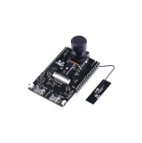 [**REALTEK AMB82 MINI IOT AI CAMERA**](https://www.amazon.com/studio-Realtek-AMB82-Mini-Camera-Arduino/dp/B0CRYQ84RX) | - On-board AI object detection software - Wide-angle lens allows for full vision of pipe ahead - High-resolution camera with fast frame rates allows for quick real-time object detection | - Focal length is non-adjustable and set for long distance - Short custom data cable means the entire module will need a unique mounting solution | $30 |
|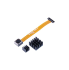 [**OV5640 CAMERA XIAO ESP32S3 SENSE**](https://www.digikey.com/en/products/detail/seeed-technology-co-ltd/114993115/21277047)| - Familiarity with platform allows for more focus on object detection development time - Long data cable allows for better mounting solution - High resolution with fast frame rates - Minimum focal length is about 10 cm, allowing for better inspection of small pipes - Low cost - Uses ESP32-S3 chip for on-board object detection | - Less RAM than other options | $24 |
|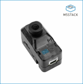 [**M5Stack**](https://shop.m5stack.com/products/m5stack-unitv2-m12-version-with-cameras) | - Highest processing power of any option - High resolution and high frame-rate video - On-board object-detection models preconfigured for common applications | - Bulky - Way out of budget - High power cost | $95 |

### Choice

[**OV5640 CAMERA XIAO ESP32S3 SENSE**](https://www.digikey.com/en/products/detail/seeed-technology-co-ltd/114993115/21277047) — upgrade to [previously used module](https://www.digikey.com/en/products/detail/seeed-technology-co-ltd/113991115/18724504)

### Rationale

The camera provides excellent video resolution and frame rate at a very low cost compared to the other options. It is also familiar to our team, so it will cut down on the amount of time needed to write the necessary software.

---

## Drive System

| Solution | Pros | Cons | Price |
|---|---|---|---:|
| 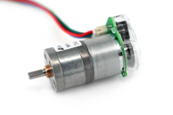 [**NFP-GM25-310-OEN**](https://www.amazon.com/GM25-310-Photoelectric-Measuring-Two-Wheel-Balancing/dp/B0C2VDCC98) | - True optical encoder - Stronger than N20 - 360 CPR provides good feedback - 3.3/5 V encoder interface - Multiple gear ratios - Compact enough for the pipe robot - Good balance of speed and torque | - Larger than N20 - Heavier than N20 - 4 mm shaft - 7.4 V rather than 5 V - More expensive than basic N20 motors | $15 |
| 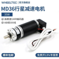 **Planetary Gear Motor with Optical Encoder** | - Very high torque - Planetary gearbox - Optical encoder - Available in 6 V - Excellent for heavier robots - Strong gearbox - Good positional accuracy | - 36 mm diameter - Much heavier - Could be difficult to fit inside a 4-inch pipe - Higher current requirements - More expensive | $20 |
| 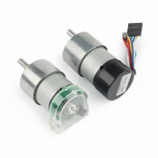 [**GM37-520**](https://www.amazon.com/CHR-GM37-520-Off-Axis-Torque-Reducer-Gearbox/dp/B0CMT1382X?th=1) | - High torque - Metal gearbox - Optical encoder versions available - Many gear ratios - Good for heavier robots - Stronger shaft and gearbox | - 37 mm diameter - Large for a 4-inch pipe - Heavy - Typically 12 V - Higher power consumption - More motor than the robot probably needs | $40 |
| 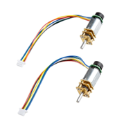 [**ROB-28633**](https://www.digikey.com/en/products/detail/sparkfun-electronics/ROB-28633/26523963) | - Compact and lightweight - Built-in Hall-effect encoder - 882 counts/revolution - Good speed and torque for its size - 31.5:1 gear ratio - Good for ESP32 control - Fits well in a 4–6 inch pipe | - Encoder is magnetic, not optical - Limited torque compared with larger motors - Wheel slip can affect distance accuracy - Small gearbox can be damaged if stalled - Requires a motor driver | $9.90 |

### Choice

[**SparkFun ROB-28633 N20 Motor With Encoder**](https://www.digikey.com/en/products/detail/sparkfun-electronics/ROB-28633/26523963)

### Rationale

The ROB-28633 was selected because its compact N20 form factor makes it well suited for the 4–6 inch pipe inspection robot. The integrated Hall-effect encoder provides 882 counts per revolution for accurate motor speed and distance feedback. Its 31.5:1 gear ratio provides a good balance between speed and torque, while its small size and low weight help keep the robot compact and maneuverable. The motor is also compatible with the ESP32 control system and is available as a matched pair for the two-wheel drive system.

---

## Drive Sensing

| Solution | Pros | Cons | Price |
|---|---|---|---:|
| 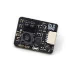 [**MicoAir MTF-02P**](https://www.amazon.com/MicoAir-Optical-MTF-02P-Compatible-Ardupilot/dp/B0DM67PB1K) | - Optical flow + range in one - 6 m range - Very small and lightweight - 5 V operation - 50 Hz output - UART communication | - More expensive than basic optical-flow sensors - Requires UART programming - Optical flow requires adequate lighting | $28 |
| 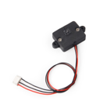 **Holybro PMW3901** | - Small and lightweight - Good optical-flow tracking - 95 Hz output - UART interface - Low power consumption - Easy to integrate | - No built-in distance sensor - Requires a separate range sensor - Less functionality than the MTF-02P | $20.59 |
| 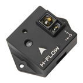 **Holybro H-Flow** | - Optical flow + distance sensor - Up to 30 m range - Built-in 6-axis IMU - Works in low-light conditions - CAN/DroneCAN communication - Very capable sensor | - Much more expensive - Heavier at 15.2 g - More complicated than needed - Larger than the MTF-02P | $145 |

### Choice

[**MicoAir Optical Flow & Range Sensor MTF-02P**](https://www.amazon.com/MicoAir-Optical-MTF-02P-Compatible-Ardupilot/dp/B0DM67PB1K)

### Rationale

The MTF-02P was selected because it combines optical flow and distance measurement into one compact and lightweight sensor. Its 6 m range, 50 Hz output, and 5 V operation make it well suited for the pipe inspection robot. Using one sensor for both functions reduces the number of components and saves space, while providing movement and distance data that can work with the N20 motor encoders to improve the robot’s navigation and return-to-start accuracy.

---

## Chassis

| Solution | Pros | Cons | Price |
|---|---|---|---:|
|  [**Mini RC Truck, 1:64 Scale Monster Truck**](http://amazon.com/gp/aw/d/B0DMW81N1H/?_encoding=UTF8&pd_rd_plhdr=t&aaxitk=9cc0125e62e2c5a25db58d004f249b14&hsa_cr_id=0&qid=1772599395&sr=1-1-9e67e56a-6f64-441f-a281-df67fc737124&ref_=sbx_s_sparkle_sbtcd_asin_0_title&pd_rd_w=wBchM&content-id=amzn1.sym.9f2b2b9e-47e9-4764-a4dc-2be2f6fca36d%3Aamzn1.sym.9f2b2b9e-47e9-4764-a4dc-2be2f6fca36d&pf_rd_p=9f2b2b9e-47e9-4764-a4dc-2be2f6fca36d&pf_rd_r=ESK7BKKDKWR7T78W6JFN&pd_rd_wg=DVVPd&pd_rd_r=beebd90e-6403-4bb7-b0e6-e4d8515845a8&th=1) | - Fits within 4-inch pipe with its cosmetics attached - Allows room to attach components with cosmetic shell removed - Trailer hitch can be used to attach rescue line without modification - Off-road tires allow for easy traversal of pipes | - Uses generic remote with limited range (30 m) - Limited battery life (20 minutes) - High price means only one can be bought for prototyping | $18 each |
| 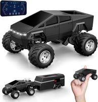 [**Mini RC Truck, 1:64 Scale Monster Truck Remote Control Car with Lights**](https://www.amazon.com/DDZOOU-Mini-Truck-Rechargeable-Adjustable/dp/B0F8QVP1JB/ref=sr_1_1_sspa?crid=31093XAH4DH2A&dib=eyJ2IjoiMSJ9.R5lU3AIb3UESFJX85B1DEAUXQZDKsg6tbDXb7izM6PXezVQTlx4gHxhxyy2nQdPkcscnMcD2azL1drdtaxoqxo2nt1JnSSUoA5UZnRY9myeQqGAtAVv_amOiidoQYnvWivE7ApjBfwVmsY9BTT7VUZaV1DpzfJoTWPng86WB-jHzmTSENxD-uNW7npG8iSVLCYA0o-bBeolxr9Eb_LbWdhtHWSytYBhW_nAFB9Lsnj2dl-_003bwqLaJad5EuSpueuYVECPhYuc00BYo4OVHGw_ri3We64K_9CK5OR_zvIo.IWu29MUciEHtHukflzQ3klrPCYm1Sj5ni4Cdg_wvDO4&dib_tag=se&keywords=micro%2Brc%2Btruck&qid=1772599395&sprefix=micro%2Brc%2Btruck%2Caps%2C189&sr=8-1-spons&sp_csd=d2lkZ2V0TmFtZT1zcF9hdGY&th=1) | - Allows more room to attach components with cosmetic shell removed - Trailer hitch can be used to attach rescue line without modification - Off-road tires allow for easy traversal of pipes - Can use phone app instead of remote | - Taller than needed (4.1 inches) - Uses generic remote with limited range (30 m) - Limited battery life (20 minutes) - High price means only one can be bought for prototyping - Phone app has very limited range | $19 each |
| 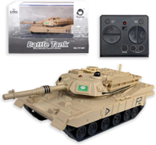 [**2.4GHz Mini RC Tank Toy with LED and Rotating Turret**](https://www.amazon.com/2-4GHz-Rotating-Turret-Ultimate-Military/dp/B0D6G82XWM/ref=sr_1_6?crid=1VYBVR3EA2PX9&dib=eyJ2IjoiMSJ9.OJM5_Xao0IyzGW_jRRWdjvUSvdJLoBGJxXR3RYr7zeoT2epLGY-q0SHrv8c4em_vGZyYOqbS2usZCW5CrwC0TDSBQek8LimjynuGk4_GaNC0NErUgB-mOCefmE-UkdsEZBvBtRN1835zMm-ojcNW9rT01hpYw0q3QDOgziHxeTG75OhqbGi5ZfCFM5wP0mifkVFNYycAIT4US7rKStEXepHygCp00y7m3Sy9rgrYPmxywPEa5WSHgqLwdc-ZpHes7tB9G0kYoWNCYCmUcQ_sCAywI28LWdsajvABeB0G6Tc.pvK_RL0quRfn_FfkvnD1E47qTfoTwk7bct1sldSNA60&dib_tag=se&keywords=micro%2Brc%2Btank&qid=1772600293&sprefix=micro%2Brc%2Btank%2Caps%2C196&sr=8-6&th=1) | - Flat chassis allows for stable platform to build from - Rotating turret could be utilized to give a 360° camera view - Treads allow for easier traversal of rough terrain | - High price point makes any testing or modification risky because duplicates cannot be afforded - Turret mechanism is difficult to disassemble carefully - Paying for unneeded features such as speakers | $23 each |

### Choice

[**2.4 GHz Mini RC Tank Chassis**](https://www.amazon.com/2-4GHz-Rotating-Turret-Ultimate-Military/dp/B0D6G82XWM/ref=sr_1_6?crid=1VYBVR3EA2PX9&dib=eyJ2IjoiMSJ9.OJM5_Xao0IyzGW_jRRWdjvUSvdJLoBGJxXR3RYr7zeoT2epLGY-q0SHrv8c4em_vGZyYOqbS2usZCW5CrwC0TDSBQek8LimjynuGk4_GaNC0NErUgB-mOCefmE-UkdsEZBvBtRN1835zMm-ojcNW9rT01hpYw0q3QDOgziHxeTG75OhqbGi5ZfCFM5wP0mifkVFNYycAIT4US7rKStEXepHygCp00y7m3Sy9rgrYPmxywPEa5WSHgqLwdc-ZpHes7tB9G0kYoWNCYCmUcQ_sCAywI28LWdsajvABeB0G6Tc.pvK_RL0quRfn_FfkvnD1E47qTfoTwk7bct1sldSNA60&dib_tag=se&keywords=micro%2Brc%2Btank&qid=1772600293&sprefix=micro%2Brc%2Btank%2Caps%2C196&sr=8-6&th=1)

### Rationale

The tank chassis was selected because its treads provide better traction and reduce slipping compared to wheeled chassis. The flat chassis provides a stable platform for mounting the ESP32, motor driver, sensors, and battery, while the compact design allows the robot to traverse rough and uneven surfaces inside the pipe.

---

## Motor Controller

| Solution | Pros | Cons | Price |
|---|---|---|---:|
| 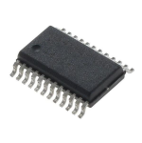 [**DRV8833PWPR**](https://www.digikey.com/en/products/detail/texas-instruments/DRV8833PWPR/2743167?msockid=2aa431d6e20468cc094d263ae36269aa) | - Surface-mount HTSSOP package - Controls 2 DC motors - 1.5 A output per channel - Compact and lightweight - Works directly with ESP32 PWM signals - Low cost | - Motor supply limited to 10.8 V - Less current capability than DRV8848 | $3.02 |
| 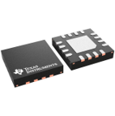 **TB6612FNG** | - Surface-mount 24-SSOP package - Controls 2 DC motors - Up to 1 A continuous per channel - Motor voltage up to 13.5 V - Low power consumption - Inexpensive | - Larger package than DRV8833 - Lower current capability - Operating temperature is only -20°C to 85°C | $2.04 |
| 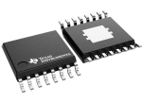 [**DRV8848PWPR**](https://www.digikey.com/en/products/detail/texas-instruments/DRV8848PWPR/6571780?msockid=2aa431d6e20468cc094d263ae36269aa) | - Surface-mount HTSSOP package - Controls 2 DC motors - Up to 2 A per bridge / 4 A parallel - Motor voltage 4–18 V - More current capacity and voltage headroom - Built-in protection features | - More capability than the small N20 motors require - Slightly more expensive - More complex than necessary for this project | $2.97 |

### Choice

[**DRV8833PWPR Motor Driver**](https://www.digikey.com/en/products/detail/texas-instruments/DRV8833PWPR/2743167?msockid=2aa431d6e20468cc094d263ae36269aa)

### Rationale

The DRV8833PWPR was selected because it can operate with a 5 V motor supply, supports two DC motors, and can be soldered directly to the PCB using its surface-mount package. Its compact size, low cost, and compatibility with the ESP32 make it well suited for controlling the two N20 motors while keeping the robot’s electronics compact.
